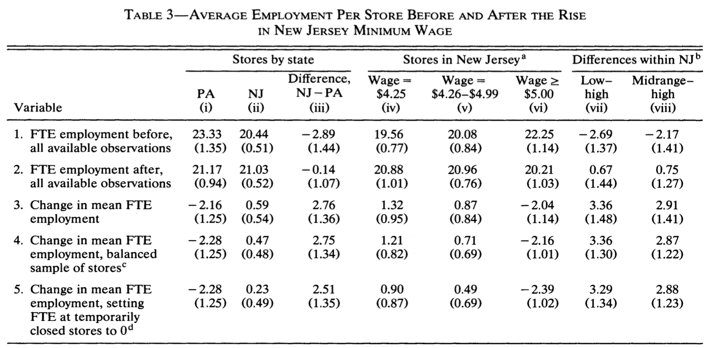

# 摘要

## 國內現況

### 基本工資調漲 4.56%

```         
2023年1月1日起
基本工資確定調漲為月薪26,400元
時薪176元
```


### 基本工資連續七年調漲

```         
2023 年調薪後
最直接的影響就是勞健保和勞退金
(領基本工資者)
對企業雇主來說成本增加 5.41%
```


## 人事成本變高，那就少用點人吧

<iframe src="https:////plotly.com/~seimwiwa/15.embed" width="672" height="400px" data-external="1"></iframe>

## 基本工資的增加，真的會造成僱員數量減少（失業率增加）嗎？

```         
評估基本工資調漲對就業市場的衝擊
紐澤西與賓州速食店的案例研究
```

-   1992 年初紐澤西調漲基本工資

    -   由每小時 USD 4.25 提高至 USD 5.05

-   當「單位勞動力價格 ↑」，可能會造成

    -   就業人口 ↓

    -   就業率 ↓

-   因此，經濟學家想要評估「調漲基本工資對低工資的勞工就業人口的影響」

## 本文資訊

-   Author: David Card and Alan B. Krueger

-   Publish date: October 1993

-   Publish at: National Bureau of Economic Research Working Paper Series

-   DOI: 10.3386/w4509

-   [WEB Page](https://www.nber.org/papers/w4509)

-   [PDF](https://www.nber.org/system/files/working_papers/w4509/w4509.pdf)

## 其他參考資訊

-   [FRED - State Minimum Wage Rate for New Jersey](https://fred.stlouisfed.org/series/STTMINWGNJ)

-   [FRED - Unemployment Rate in New Jersey](https://fred.stlouisfed.org/series/NJURN)

-   [David Card - Dataset](https://davidcard.berkeley.edu/data_sets.html)

-   [GitHub / alopatina / Applied-Causal-Analysis](https://github.com/alopatina/Applied-Causal-Analysis)

-   [GitHub / BiomedSciAI / causallib](https://github.com/alopatina/Applied-Causal-Analysis)

-   [GitHub / dnackat / data-analysis-for-social-scientists-mitx](https://github.com/dnackat/data-analysis-for-social-scientists-mitx/blob/master/Homeworks/HW9/hw9.R)

-   [Create supply and demand economics curves with ggplot2](https://www.andrewheiss.com/blog/2017/09/15/create-supply-and-demand-economics-curves-with-ggplot2/)

-   [2023年(112年)基本工資調漲，企業注意事項總整理！](https://blog.trendlink.com.tw/2022/09/2023-basic-wage/)

-   [Standard error of the difference between means](https://rpubs.com/brouwern/SEdiff2means)

-   [5. Differences between means: type I and type II errors and power](https://www.bmj.com/about-bmj/resources-readers/publications/statistics-square-one/5-differences-between-means-type-i-an)

# 研究背景

## 紐澤西的就業政策與時空背景

-   1989 年底紐澤西州立法調漲基本工資 USD 3.35 ➜ USD 3.80

-   1990 年初再次立法調漲基本工資 ➜ USD 4.25

-   1992 年初第三次立法調漲基本工資 ➜ USD 5.05

<iframe src="https:////plotly.com/~seimwiwa/17.embed" width="672" height="400px" data-external="1"></iframe>

# 研究方法

## 研究策略思考

-   直接想像：前後對照

    -   其實可以只看紐澤西速食店調漲前後的差異

    -   但無法避免「時間與季節性因素」的混淆

-   其他可以利用的條件

    -   紐澤西有調漲基本工資、但隔壁的賓州沒有

    -   紐澤西是小州，經濟與附近各州有密切聯繫

    -   比較「紐澤西前後差異」、與「賓州前後差異」的差異，可以有效避開混淆

## 研究類型

Prospective Cohort study with Fixed Population

前瞻性固定人群的隊列研究

-   Prospective 前瞻性

-   Cohort Study 隊列研究

-   Fixed Population 固定人群

## 名詞解釋

### Cohort Study

-   實驗性研究（RCT、A B test）以外最常用的兩種觀察性研究方法之一

-   在⼀段時間內追踪特定族群（具有共同特徵或經歷）

-   先找好幾群要觀察的人，隨著時間推移持續觀察他們的變化

-   有時候稱：follow-up、longitudinal study 縱向研究

### Prospective Cohort Study

-   定義：先開始專案規劃選定人群後，事件才發生、數據才開始記錄

-   操作：根據過去或當前的資料來進行分眾

-   優勢：精確、麻煩、資訊少、偏差少

-   劣勢：跟實驗一樣需等待、可能存在偏誤、與混淆因子

    -   可能的偏誤：Losses to Follow-Up、Healthy Worker Effect

### Fixed population 固定人群

-   依據特徵或暴露因子分組後，組別不會隨時間改變

-   但參與分組的研究對象可能隨時間而失去聯繫 Losses to Follow-Up

## 研究時間

-   planning: early 1992

-   1st interview: 1992 年 2 \~ 3 月

    -   電訪

-   2nd interview: 1992 年 11 \~ 12 月

    -   電訪 + 實地確認 Losses to Follow-Up

## 研究對象

-   subject: 速食店

    -   低薪者多，低薪者中 25% 在速食店工作

    -   速食店都只給基本工資，所以會需要跟進調漲薪資

    -   速食店工作和產品同值性高，容易取得可靠就業、工資、產品數據、沒有小費（減少薪資衡量困難）

    -   速食店是需要特許經營，選樣本相對容易

    -   過去經驗表明速食店對電話訪談的回覆意願高

## 暴露因子與結果

-   outcome: 員工數量改變

-   exposure / treatment: 基本工資由 4.25 -\> 5.05, 1992, Apr., NJ

    -   exp group: 會調漲基本工資的紐澤西，n = 364

    -   non-exp group: 不會調漲基本工資的賓州，n = 109

## 統計方法

1.  T-statistic for test of equality of means

2.  Linear regression

# 研究結果

## Table: 1 Sample Design and Response Rate

-   確認收樣的概況

-   並清楚說明 loss to follow-up 的原因：有時 loss to follow-up 受 exposure 影響，所以必須確認兩者無關


<table class="table table-hover table-condensed table-striped" style="width: auto !important; margin-left: auto; margin-right: auto;">
 <thead>
<tr>
<th style="empty-cells: hide;border-bottom:hidden;" colspan="3"></th>
<th style="border-bottom:hidden;padding-bottom:0; padding-left:3px;padding-right:3px;text-align: center; " colspan="4"><div style="border-bottom: 1px solid #ddd; padding-bottom: 5px; ">餐廳位置（州）</div></th>
</tr>
<tr>
<th style="empty-cells: hide;border-bottom:hidden;" colspan="1"></th>
<th style="border-bottom:hidden;padding-bottom:0; padding-left:3px;padding-right:3px;text-align: center; " colspan="2"><div style="border-bottom: 1px solid #ddd; padding-bottom: 5px; ">所有樣本</div></th>
<th style="border-bottom:hidden;padding-bottom:0; padding-left:3px;padding-right:3px;text-align: center; " colspan="2"><div style="border-bottom: 1px solid #ddd; padding-bottom: 5px; ">New Jersey</div></th>
<th style="border-bottom:hidden;padding-bottom:0; padding-left:3px;padding-right:3px;text-align: center; " colspan="2"><div style="border-bottom: 1px solid #ddd; padding-bottom: 5px; ">Pennsylvania</div></th>
</tr>
  <tr>
   <th style="text-align:left;">   </th>
   <th style="text-align:right;">   </th>
   <th style="text-align:right;"> % </th>
   <th style="text-align:right;">   </th>
   <th style="text-align:right;"> % </th>
   <th style="text-align:right;">   </th>
   <th style="text-align:right;"> % </th>
  </tr>
 </thead>
<tbody>
  <tr grouplength="3"><td colspan="7" style="background-color: #3CA6A6; color: #fff;"><strong>前測<br>1992/02/15 ~ 03/04</strong></td></tr>
<tr>
   <td style="text-align:left;padding-left: 2em;" indentlevel="1"> 餐廳數量<sup>a</sup> </td>
   <td style="text-align:right;"> 473 </td>
   <td style="text-align:right;"> 100.0% </td>
   <td style="text-align:right;"> 364 </td>
   <td style="text-align:right;"> 100.0% </td>
   <td style="text-align:right;"> 109 </td>
   <td style="text-align:right;"> 100.0% </td>
  </tr>
  <tr>
   <td style="text-align:left;padding-left: 2em;" indentlevel="1"> 拒絕 </td>
   <td style="text-align:right;"> 63 </td>
   <td style="text-align:right;"> 13.3% </td>
   <td style="text-align:right;"> 33 </td>
   <td style="text-align:right;"> 9.1% </td>
   <td style="text-align:right;"> 30 </td>
   <td style="text-align:right;"> 27.5% </td>
  </tr>
  <tr>
   <td style="text-align:left;padding-left: 2em;" indentlevel="1"> 受訪 </td>
   <td style="text-align:right;"> 410 </td>
   <td style="text-align:right;"> 86.7% </td>
   <td style="text-align:right;"> 331 </td>
   <td style="text-align:right;"> 90.9% </td>
   <td style="text-align:right;"> 79 </td>
   <td style="text-align:right;"> 72.5% </td>
  </tr>
  <tr grouplength="6"><td colspan="7" style="background-color: #3CA6A6; color: #fff;"><strong>後測<br>1992/11/05 ~ 12/31</strong></td></tr>
<tr>
   <td style="text-align:left;padding-left: 2em;" indentlevel="1"> 餐廳數量 </td>
   <td style="text-align:right;"> 410 </td>
   <td style="text-align:right;"> 86.7% </td>
   <td style="text-align:right;"> 331 </td>
   <td style="text-align:right;"> 90.9% </td>
   <td style="text-align:right;"> 79 </td>
   <td style="text-align:right;"> 72.5% </td>
  </tr>
  <tr>
   <td style="text-align:left;padding-left: 2em;" indentlevel="1"> 已關閉 </td>
   <td style="text-align:right;"> 6 </td>
   <td style="text-align:right;"> 1.3% </td>
   <td style="text-align:right;"> 5 </td>
   <td style="text-align:right;"> 1.4% </td>
   <td style="text-align:right;"> 1 </td>
   <td style="text-align:right;"> 0.9% </td>
  </tr>
  <tr>
   <td style="text-align:left;padding-left: 2em;" indentlevel="1"> 裝修中 </td>
   <td style="text-align:right;"> 2 </td>
   <td style="text-align:right;"> 0.4% </td>
   <td style="text-align:right;"> 2 </td>
   <td style="text-align:right;"> 0.5% </td>
   <td style="text-align:right;"> 0 </td>
   <td style="text-align:right;"> 0.0% </td>
  </tr>
  <tr>
   <td style="text-align:left;padding-left: 2em;" indentlevel="1"> 暫時關閉<sup>b</sup> </td>
   <td style="text-align:right;"> 2 </td>
   <td style="text-align:right;"> 0.4% </td>
   <td style="text-align:right;"> 2 </td>
   <td style="text-align:right;"> 0.5% </td>
   <td style="text-align:right;"> 0 </td>
   <td style="text-align:right;"> 0.0% </td>
  </tr>
  <tr>
   <td style="text-align:left;padding-left: 2em;" indentlevel="1"> 拒絕 </td>
   <td style="text-align:right;"> 1 </td>
   <td style="text-align:right;"> 0.2% </td>
   <td style="text-align:right;"> 1 </td>
   <td style="text-align:right;"> 0.3% </td>
   <td style="text-align:right;"> 0 </td>
   <td style="text-align:right;"> 0.0% </td>
  </tr>
  <tr>
   <td style="text-align:left;padding-left: 2em;" indentlevel="1"> 受訪<sup>c</sup> </td>
   <td style="text-align:right;"> 399 </td>
   <td style="text-align:right;"> 84.4% </td>
   <td style="text-align:right;"> 321 </td>
   <td style="text-align:right;"> 88.2% </td>
   <td style="text-align:right;"> 78 </td>
   <td style="text-align:right;"> 71.6% </td>
  </tr>
</tbody>
<tfoot>
<tr>
<td style = 'padding: 0; border:0;' colspan='100%'><sup>a</sup> 在收樣階段，有 29 間餐廳因為沒有電話而移除，目前的 473 間餐廳僅均為有電話者</td>
</tr>
<tr>
<td style = 'padding: 0; border:0;' colspan='100%'><sup>b</sup> 後測時，各有一間餐廳分別因為：高速公路工程、火災暫時關閉</td>
</tr>
<tr>
<td style = 'padding: 0; border:0;' colspan='100%'><sup>c</sup> 後測過程中，有 371 間餐廳為電話訪談、28 間因為拒絕電訪而採用實體訪問</td>
</tr>
</tfoot>
</table>

## Table 2: Means of Key Variables

-   比較兩個 Cohort 的差異，如果基本特徵就有差異，那後續 Cohort 的 outcome 不一樣可能受到其他因素干擾，就無法驗證其他假設

-   比較平均數，也就是分別把 NJ 跟 PA 的數據計算出估計值、與標準誤；因為餐廳類型、直營/加盟是類別變項，原文是將其視為不同的特徵（欄位），其值均為 1 或 0


<table class="table table-hover table-condensed table-striped" style="width: auto !important; margin-left: auto; margin-right: auto;">
 <thead>
<tr>
<th style="empty-cells: hide;border-bottom:hidden;" colspan="1"></th>
<th style="border-bottom:hidden;padding-bottom:0; padding-left:3px;padding-right:3px;text-align: center; " colspan="4"><div style="border-bottom: 1px solid #ddd; padding-bottom: 5px; ">餐廳位置（州）</div></th>
<th style="empty-cells: hide;border-bottom:hidden;" colspan="2"></th>
</tr>
<tr>
<th style="empty-cells: hide;border-bottom:hidden;" colspan="1"></th>
<th style="border-bottom:hidden;padding-bottom:0; padding-left:3px;padding-right:3px;text-align: center; " colspan="2"><div style="border-bottom: 1px solid #ddd; padding-bottom: 5px; ">New Jersey</div></th>
<th style="border-bottom:hidden;padding-bottom:0; padding-left:3px;padding-right:3px;text-align: center; " colspan="2"><div style="border-bottom: 1px solid #ddd; padding-bottom: 5px; ">Pennsylvania</div></th>
<th style="border-bottom:hidden;padding-bottom:0; padding-left:3px;padding-right:3px;text-align: center; " colspan="2"><div style="border-bottom: 1px solid #ddd; padding-bottom: 5px; ">Test of equality<br>of means</div></th>
</tr>
  <tr>
   <th style="text-align:left;"> 特徵 </th>
   <th style="text-align:right;"> 樣本數 </th>
   <th style="text-align:right;"> % </th>
   <th style="text-align:right;"> 樣本數 </th>
   <th style="text-align:right;"> % </th>
   <th style="text-align:right;"> t value </th>
   <th style="text-align:right;"> p value </th>
  </tr>
 </thead>
<tbody>
  <tr grouplength="4"><td colspan="7" style="background-color: #3CA6A6; color: #fff;"><strong>餐廳類型</strong></td></tr>
<tr>
   <td style="text-align:left;padding-left: 2em;" indentlevel="1"> Burger King </td>
   <td style="text-align:right;"> 136 </td>
   <td style="text-align:right;"> 41.1% </td>
   <td style="text-align:right;"> 35 </td>
   <td style="text-align:right;"> 44.3% </td>
   <td style="text-align:right;"> -0.52 </td>
   <td style="text-align:right;"> 0.607 </td>
  </tr>
  <tr>
   <td style="text-align:left;padding-left: 2em;" indentlevel="1"> KFC </td>
   <td style="text-align:right;"> 68 </td>
   <td style="text-align:right;"> 20.5% </td>
   <td style="text-align:right;"> 12 </td>
   <td style="text-align:right;"> 15.2% </td>
   <td style="text-align:right;"> 1.16 </td>
   <td style="text-align:right;"> 0.250 </td>
  </tr>
  <tr>
   <td style="text-align:left;padding-left: 2em;" indentlevel="1"> Roy Rogers </td>
   <td style="text-align:right;"> 82 </td>
   <td style="text-align:right;"> 24.8% </td>
   <td style="text-align:right;"> 17 </td>
   <td style="text-align:right;"> 21.5% </td>
   <td style="text-align:right;"> 0.62 </td>
   <td style="text-align:right;"> 0.535 </td>
  </tr>
  <tr>
   <td style="text-align:left;padding-left: 2em;" indentlevel="1"> Wendy's </td>
   <td style="text-align:right;"> 45 </td>
   <td style="text-align:right;"> 13.6% </td>
   <td style="text-align:right;"> 15 </td>
   <td style="text-align:right;"> 19.0% </td>
   <td style="text-align:right;"> -1.12 </td>
   <td style="text-align:right;"> 0.266 </td>
  </tr>
  <tr grouplength="2"><td colspan="7" style="background-color: #3CA6A6; color: #fff;"><strong>直營/加盟</strong></td></tr>
<tr>
   <td style="text-align:left;padding-left: 2em;" indentlevel="1"> 直營店 </td>
   <td style="text-align:right;"> 113 </td>
   <td style="text-align:right;"> 34.1% </td>
   <td style="text-align:right;"> 28 </td>
   <td style="text-align:right;"> 35.4% </td>
   <td style="text-align:right;"> -0.22 </td>
   <td style="text-align:right;"> 0.829 </td>
  </tr>
  <tr>
   <td style="text-align:left;padding-left: 2em;" indentlevel="1"> 加盟店 </td>
   <td style="text-align:right;"> 218 </td>
   <td style="text-align:right;"> 65.9% </td>
   <td style="text-align:right;"> 51 </td>
   <td style="text-align:right;"> 64.6% </td>
   <td style="text-align:right;"> 0.22 </td>
   <td style="text-align:right;"> 0.829 </td>
  </tr>
</tbody>
</table>

<table class="table table-hover table-condensed table-striped" style="width: auto !important; margin-left: auto; margin-right: auto;">
 <thead>
<tr>
<th style="empty-cells: hide;border-bottom:hidden;" colspan="1"></th>
<th style="border-bottom:hidden;padding-bottom:0; padding-left:3px;padding-right:3px;text-align: center; " colspan="6"><div style="border-bottom: 1px solid #ddd; padding-bottom: 5px; ">餐廳位置（州）</div></th>
<th style="empty-cells: hide;border-bottom:hidden;" colspan="2"></th>
</tr>
<tr>
<th style="empty-cells: hide;border-bottom:hidden;" colspan="1"></th>
<th style="border-bottom:hidden;padding-bottom:0; padding-left:3px;padding-right:3px;text-align: center; " colspan="3"><div style="border-bottom: 1px solid #ddd; padding-bottom: 5px; ">New Jersey</div></th>
<th style="border-bottom:hidden;padding-bottom:0; padding-left:3px;padding-right:3px;text-align: center; " colspan="3"><div style="border-bottom: 1px solid #ddd; padding-bottom: 5px; ">Pennsylvania</div></th>
<th style="border-bottom:hidden;padding-bottom:0; padding-left:3px;padding-right:3px;text-align: center; " colspan="2"><div style="border-bottom: 1px solid #ddd; padding-bottom: 5px; ">Test of equality<br>of means</div></th>
</tr>
  <tr>
   <th style="text-align:left;"> 特徵 </th>
   <th style="text-align:right;"> 樣本數 </th>
   <th style="text-align:right;"> 平均值 </th>
   <th style="text-align:right;"> 標準誤 </th>
   <th style="text-align:right;"> 樣本數 </th>
   <th style="text-align:right;"> 平均值 </th>
   <th style="text-align:right;"> 標準誤 </th>
   <th style="text-align:left;"> t value </th>
   <th style="text-align:right;"> p value </th>
  </tr>
 </thead>
<tbody>
  <tr grouplength="7"><td colspan="9" style="background-color: #3CA6A6; color: #fff;"><strong>前測<br>1992/02/15 ~ 03/04</strong></td></tr>
<tr>
   <td style="text-align:left;padding-left: 2em;" indentlevel="1"> 全職人力工時 FTE </td>
   <td style="text-align:right;"> 321 </td>
   <td style="text-align:right;"> 20.44 </td>
   <td style="text-align:right;"> 0.51 </td>
   <td style="text-align:right;"> 77 </td>
   <td style="text-align:right;"> 23.33 </td>
   <td style="text-align:right;"> 1.35 </td>
   <td style="text-align:left;"> -2.00 </td>
   <td style="text-align:right;"> 0.05 </td>
  </tr>
  <tr>
   <td style="text-align:left;padding-left: 2em;" indentlevel="1"> 正職人數 / FTE % </td>
   <td style="text-align:right;"> 321 </td>
   <td style="text-align:right;"> 32.85 </td>
   <td style="text-align:right;"> 1.33 </td>
   <td style="text-align:right;"> 77 </td>
   <td style="text-align:right;"> 35.04 </td>
   <td style="text-align:right;"> 2.73 </td>
   <td style="text-align:left;"> -0.72 </td>
   <td style="text-align:right;"> 0.47 </td>
  </tr>
  <tr>
   <td style="text-align:left;padding-left: 2em;" indentlevel="1"> 起薪 </td>
   <td style="text-align:right;"> 314 </td>
   <td style="text-align:right;"> 4.61 </td>
   <td style="text-align:right;"> 0.02 </td>
   <td style="text-align:right;"> 76 </td>
   <td style="text-align:right;"> 4.63 </td>
   <td style="text-align:right;"> 0.04 </td>
   <td style="text-align:left;"> -0.40 </td>
   <td style="text-align:right;"> 0.69 </td>
  </tr>
  <tr>
   <td style="text-align:left;padding-left: 2em;" indentlevel="1"> 薪資 = $4.25 % </td>
   <td style="text-align:right;"> 331 </td>
   <td style="text-align:right;"> 30.51 </td>
   <td style="text-align:right;"> 2.53 </td>
   <td style="text-align:right;"> 79 </td>
   <td style="text-align:right;"> 32.91 </td>
   <td style="text-align:right;"> 5.32 </td>
   <td style="text-align:left;"> -0.41 </td>
   <td style="text-align:right;"> 0.68 </td>
  </tr>
  <tr>
   <td style="text-align:left;padding-left: 2em;font-weight: bold;color: #3CA6A6 !important;" indentlevel="1"> 套餐金額 </td>
   <td style="text-align:right;font-weight: bold;color: #3CA6A6 !important;"> 311 </td>
   <td style="text-align:right;font-weight: bold;color: #3CA6A6 !important;"> 3.35 </td>
   <td style="text-align:right;font-weight: bold;color: #3CA6A6 !important;"> 0.04 </td>
   <td style="text-align:right;font-weight: bold;color: #3CA6A6 !important;"> 76 </td>
   <td style="text-align:right;font-weight: bold;color: #3CA6A6 !important;"> 3.04 </td>
   <td style="text-align:right;font-weight: bold;color: #3CA6A6 !important;"> 0.07 </td>
   <td style="text-align:left;font-weight: bold;color: #3CA6A6 !important;"> 3.96 </td>
   <td style="text-align:right;font-weight: bold;color: #3CA6A6 !important;"> 0.00 </td>
  </tr>
  <tr>
   <td style="text-align:left;padding-left: 2em;" indentlevel="1"> 營業時長 </td>
   <td style="text-align:right;"> 331 </td>
   <td style="text-align:right;"> 14.42 </td>
   <td style="text-align:right;"> 0.15 </td>
   <td style="text-align:right;"> 79 </td>
   <td style="text-align:right;"> 14.53 </td>
   <td style="text-align:right;"> 0.33 </td>
   <td style="text-align:left;"> -0.29 </td>
   <td style="text-align:right;"> 0.77 </td>
  </tr>
  <tr>
   <td style="text-align:left;padding-left: 2em;" indentlevel="1"> 招聘獎金 % </td>
   <td style="text-align:right;"> 331 </td>
   <td style="text-align:right;"> 23.56 </td>
   <td style="text-align:right;"> 2.34 </td>
   <td style="text-align:right;"> 79 </td>
   <td style="text-align:right;"> 29.11 </td>
   <td style="text-align:right;"> 5.14 </td>
   <td style="text-align:left;"> -0.98 </td>
   <td style="text-align:right;"> 0.33 </td>
  </tr>
  <tr grouplength="8"><td colspan="9" style="background-color: #3CA6A6; color: #fff;"><strong>後測<br>1992/11/05 ~ 12/31</strong></td></tr>
<tr>
   <td style="text-align:left;padding-left: 2em;" indentlevel="1"> 全職人力工時 FTE </td>
   <td style="text-align:right;"> 319 </td>
   <td style="text-align:right;"> 21.03 </td>
   <td style="text-align:right;"> 0.52 </td>
   <td style="text-align:right;"> 77 </td>
   <td style="text-align:right;"> 21.17 </td>
   <td style="text-align:right;"> 0.94 </td>
   <td style="text-align:left;"> -0.13 </td>
   <td style="text-align:right;"> 0.90 </td>
  </tr>
  <tr>
   <td style="text-align:left;padding-left: 2em;" indentlevel="1"> 正職人數 / FTE % </td>
   <td style="text-align:right;"> 314 </td>
   <td style="text-align:right;"> 35.87 </td>
   <td style="text-align:right;"> 1.38 </td>
   <td style="text-align:right;"> 76 </td>
   <td style="text-align:right;"> 30.38 </td>
   <td style="text-align:right;"> 2.81 </td>
   <td style="text-align:left;"> 1.75 </td>
   <td style="text-align:right;"> 0.08 </td>
  </tr>
  <tr>
   <td style="text-align:left;padding-left: 2em;font-weight: bold;color: #3CA6A6 !important;" indentlevel="1"> 起薪 </td>
   <td style="text-align:right;font-weight: bold;color: #3CA6A6 !important;"> 318 </td>
   <td style="text-align:right;font-weight: bold;color: #3CA6A6 !important;"> 5.08 </td>
   <td style="text-align:right;font-weight: bold;color: #3CA6A6 !important;"> 0.01 </td>
   <td style="text-align:right;font-weight: bold;color: #3CA6A6 !important;"> 71 </td>
   <td style="text-align:right;font-weight: bold;color: #3CA6A6 !important;"> 4.62 </td>
   <td style="text-align:right;font-weight: bold;color: #3CA6A6 !important;"> 0.04 </td>
   <td style="text-align:left;font-weight: bold;color: #3CA6A6 !important;"> 10.82 </td>
   <td style="text-align:right;font-weight: bold;color: #3CA6A6 !important;"> 0.00 </td>
  </tr>
  <tr>
   <td style="text-align:left;padding-left: 2em;font-weight: bold;color: #3CA6A6 !important;" indentlevel="1"> 薪資 = $4.25 % </td>
   <td style="text-align:right;font-weight: bold;color: #3CA6A6 !important;"> 331 </td>
   <td style="text-align:right;font-weight: bold;color: #3CA6A6 !important;"> 0.00 </td>
   <td style="text-align:right;font-weight: bold;color: #3CA6A6 !important;"> 0.00 </td>
   <td style="text-align:right;font-weight: bold;color: #3CA6A6 !important;"> 79 </td>
   <td style="text-align:right;font-weight: bold;color: #3CA6A6 !important;"> 25.32 </td>
   <td style="text-align:right;font-weight: bold;color: #3CA6A6 !important;"> 4.92 </td>
   <td style="text-align:left;font-weight: bold;color: #3CA6A6 !important;"> -5.14 </td>
   <td style="text-align:right;font-weight: bold;color: #3CA6A6 !important;"> 0.00 </td>
  </tr>
  <tr>
   <td style="text-align:left;padding-left: 2em;font-weight: bold;color: #3CA6A6 !important;" indentlevel="1"> 薪資 = $5.05 % </td>
   <td style="text-align:right;font-weight: bold;color: #3CA6A6 !important;"> 331 </td>
   <td style="text-align:right;font-weight: bold;color: #3CA6A6 !important;"> 85.50 </td>
   <td style="text-align:right;font-weight: bold;color: #3CA6A6 !important;"> 1.94 </td>
   <td style="text-align:right;font-weight: bold;color: #3CA6A6 !important;"> 79 </td>
   <td style="text-align:right;font-weight: bold;color: #3CA6A6 !important;"> 1.27 </td>
   <td style="text-align:right;font-weight: bold;color: #3CA6A6 !important;"> 1.27 </td>
   <td style="text-align:left;font-weight: bold;color: #3CA6A6 !important;"> 36.38 </td>
   <td style="text-align:right;font-weight: bold;color: #3CA6A6 !important;"> 0.00 </td>
  </tr>
  <tr>
   <td style="text-align:left;padding-left: 2em;font-weight: bold;color: #3CA6A6 !important;" indentlevel="1"> 套餐金額 </td>
   <td style="text-align:right;font-weight: bold;color: #3CA6A6 !important;"> 305 </td>
   <td style="text-align:right;font-weight: bold;color: #3CA6A6 !important;"> 3.41 </td>
   <td style="text-align:right;font-weight: bold;color: #3CA6A6 !important;"> 0.04 </td>
   <td style="text-align:right;font-weight: bold;color: #3CA6A6 !important;"> 71 </td>
   <td style="text-align:right;font-weight: bold;color: #3CA6A6 !important;"> 3.03 </td>
   <td style="text-align:right;font-weight: bold;color: #3CA6A6 !important;"> 0.07 </td>
   <td style="text-align:left;font-weight: bold;color: #3CA6A6 !important;"> 5.08 </td>
   <td style="text-align:right;font-weight: bold;color: #3CA6A6 !important;"> 0.00 </td>
  </tr>
  <tr>
   <td style="text-align:left;padding-left: 2em;" indentlevel="1"> 營業時長 </td>
   <td style="text-align:right;"> 321 </td>
   <td style="text-align:right;"> 14.42 </td>
   <td style="text-align:right;"> 0.15 </td>
   <td style="text-align:right;"> 78 </td>
   <td style="text-align:right;"> 14.65 </td>
   <td style="text-align:right;"> 0.33 </td>
   <td style="text-align:left;"> -0.65 </td>
   <td style="text-align:right;"> 0.52 </td>
  </tr>
  <tr>
   <td style="text-align:left;padding-left: 2em;" indentlevel="1"> 招聘獎金 % </td>
   <td style="text-align:right;"> 331 </td>
   <td style="text-align:right;"> 19.34 </td>
   <td style="text-align:right;"> 2.17 </td>
   <td style="text-align:right;"> 79 </td>
   <td style="text-align:right;"> 22.78 </td>
   <td style="text-align:right;"> 4.75 </td>
   <td style="text-align:left;"> -0.66 </td>
   <td style="text-align:right;"> 0.51 </td>
  </tr>
</tbody>
</table>

## Figure 1: Distribution of Starting Wage Rates


## Table 3: Average Employment Per Store Before and After the Rise in New Jersey Minimum Wage

-   比較兩週前測、後測，以及兩次測量的差異

-   兩次測量的差異有三種計算方法，原則上都在估計同樣的母體參數，不應該差異很大

    -   平均值直接相減，標準誤可以由此計算:

        -   $EF(difference) = \sqrt{(SD_1^2/N_1 + SD_2^2/N_2)}$

    -   計算每組樣本前後差異，取平均並計算標準誤差

        -   此處計算的標準誤與文獻略有差異

    -   將歇業的 4 間餐廳的 FTE 設置為 0，計算每組樣本前後差異，取平均並計算標準誤差

        -   此處計算的標準誤與文獻略有差異



<table class="table table-hover table-condensed table-striped" style="width: auto !important; margin-left: auto; margin-right: auto;">
 <thead>
<tr>
<th style="empty-cells: hide;border-bottom:hidden;" colspan="1"></th>
<th style="border-bottom:hidden;padding-bottom:0; padding-left:3px;padding-right:3px;text-align: center; " colspan="2"><div style="border-bottom: 1px solid #ddd; padding-bottom: 5px; ">Pennsylvania</div></th>
<th style="border-bottom:hidden;padding-bottom:0; padding-left:3px;padding-right:3px;text-align: center; " colspan="2"><div style="border-bottom: 1px solid #ddd; padding-bottom: 5px; ">New Jersey</div></th>
<th style="border-bottom:hidden;padding-bottom:0; padding-left:3px;padding-right:3px;text-align: center; " colspan="2"><div style="border-bottom: 1px solid #ddd; padding-bottom: 5px; ">平均值差<br>PA - NJ</div></th>
</tr>
  <tr>
   <th style="text-align:left;"> 特徵 </th>
   <th style="text-align:right;"> 平均值 </th>
   <th style="text-align:right;"> 標準誤 </th>
   <th style="text-align:right;"> 平均值 </th>
   <th style="text-align:right;"> 標準誤 </th>
   <th style="text-align:right;"> 平均值 </th>
   <th style="text-align:right;"> 標準誤 </th>
  </tr>
 </thead>
<tbody>
  <tr>
   <td style="text-align:left;"> 全職人力工時 FTE (前測) </td>
   <td style="text-align:right;"> 23.33 </td>
   <td style="text-align:right;"> 1.35 </td>
   <td style="text-align:right;"> 20.44 </td>
   <td style="text-align:right;"> 0.51 </td>
   <td style="text-align:right;"> -2.89 </td>
   <td style="text-align:right;"> 1.91 </td>
  </tr>
  <tr>
   <td style="text-align:left;"> 全職人力工時 FTE (後測) </td>
   <td style="text-align:right;"> 21.17 </td>
   <td style="text-align:right;"> 0.94 </td>
   <td style="text-align:right;"> 21.03 </td>
   <td style="text-align:right;"> 0.52 </td>
   <td style="text-align:right;"> -0.14 </td>
   <td style="text-align:right;"> 1.33 </td>
  </tr>
  <tr>
   <td style="text-align:left;"> 後測 - 前測 (平均值差) </td>
   <td style="text-align:right;"> -2.17 </td>
   <td style="text-align:right;"> 1.65 </td>
   <td style="text-align:right;"> 0.59 </td>
   <td style="text-align:right;"> 0.73 </td>
   <td style="text-align:right;"> 2.75 </td>
   <td style="text-align:right;"> 2.33 </td>
  </tr>
  <tr>
   <td style="text-align:left;"> 後測 - 前測 (樣本差) </td>
   <td style="text-align:right;"> -2.28 </td>
   <td style="text-align:right;"> 1.25 </td>
   <td style="text-align:right;"> 0.47 </td>
   <td style="text-align:right;"> 0.48 </td>
   <td style="text-align:right;"> 2.75 </td>
   <td style="text-align:right;"> 1.77 </td>
  </tr>
  <tr>
   <td style="text-align:left;"> 後測 - 前測 (樣本差、調整暫時歇業) </td>
   <td style="text-align:right;"> -2.28 </td>
   <td style="text-align:right;"> 1.25 </td>
   <td style="text-align:right;"> 0.46 </td>
   <td style="text-align:right;"> 0.47 </td>
   <td style="text-align:right;"> 2.74 </td>
   <td style="text-align:right;"> 1.77 </td>
  </tr>
</tbody>
</table>

<table class="table table-hover table-condensed table-striped" style="width: auto !important; margin-left: auto; margin-right: auto;">
 <thead>
<tr>
<th style="empty-cells: hide;border-bottom:hidden;" colspan="1"></th>
<th style="border-bottom:hidden;padding-bottom:0; padding-left:3px;padding-right:3px;text-align: center; " colspan="10"><div style="border-bottom: 1px solid #ddd; padding-bottom: 5px; ">起薪</div></th>
</tr>
<tr>
<th style="empty-cells: hide;border-bottom:hidden;" colspan="1"></th>
<th style="border-bottom:hidden;padding-bottom:0; padding-left:3px;padding-right:3px;text-align: center; " colspan="2"><div style="border-bottom: 1px solid #ddd; padding-bottom: 5px; ">低<br>4.25</div></th>
<th style="border-bottom:hidden;padding-bottom:0; padding-left:3px;padding-right:3px;text-align: center; " colspan="2"><div style="border-bottom: 1px solid #ddd; padding-bottom: 5px; ">中<br>4.26 ~ 4.99</div></th>
<th style="border-bottom:hidden;padding-bottom:0; padding-left:3px;padding-right:3px;text-align: center; " colspan="2"><div style="border-bottom: 1px solid #ddd; padding-bottom: 5px; ">高<br> &gt;= 5.00</div></th>
<th style="border-bottom:hidden;padding-bottom:0; padding-left:3px;padding-right:3px;text-align: center; " colspan="2"><div style="border-bottom: 1px solid #ddd; padding-bottom: 5px; ">平均值差<br>低 - 高</div></th>
<th style="border-bottom:hidden;padding-bottom:0; padding-left:3px;padding-right:3px;text-align: center; " colspan="2"><div style="border-bottom: 1px solid #ddd; padding-bottom: 5px; ">平均值差<br>中 - 高</div></th>
</tr>
  <tr>
   <th style="text-align:left;"> 特徵 </th>
   <th style="text-align:right;"> 平均值 </th>
   <th style="text-align:right;"> 標準誤 </th>
   <th style="text-align:right;"> 平均值 </th>
   <th style="text-align:right;"> 標準誤 </th>
   <th style="text-align:left;"> 平均值 </th>
   <th style="text-align:right;"> 標準誤 </th>
   <th style="text-align:right;"> 平均值 </th>
   <th style="text-align:right;"> 標準誤 </th>
   <th style="text-align:right;"> 平均值 </th>
   <th style="text-align:left;"> 標準誤 </th>
  </tr>
 </thead>
<tbody>
  <tr>
   <td style="text-align:left;"> 全職人力工時 FTE (前測) </td>
   <td style="text-align:right;"> 19.56 </td>
   <td style="text-align:right;"> 0.77 </td>
   <td style="text-align:right;"> 20.08 </td>
   <td style="text-align:right;"> 0.84 </td>
   <td style="text-align:left;"> 22.25 </td>
   <td style="text-align:right;"> 1.14 </td>
   <td style="text-align:right;"> -2.69 </td>
   <td style="text-align:right;"> 1.37 </td>
   <td style="text-align:right;"> -2.17 </td>
   <td style="text-align:left;"> 1.41 </td>
  </tr>
  <tr>
   <td style="text-align:left;"> 全職人力工時 FTE (後測) </td>
   <td style="text-align:right;"> 20.88 </td>
   <td style="text-align:right;"> 1.01 </td>
   <td style="text-align:right;"> 20.96 </td>
   <td style="text-align:right;"> 0.76 </td>
   <td style="text-align:left;"> 20.21 </td>
   <td style="text-align:right;"> 1.03 </td>
   <td style="text-align:right;"> 0.66 </td>
   <td style="text-align:right;"> 1.44 </td>
   <td style="text-align:right;"> 0.74 </td>
   <td style="text-align:left;"> 1.27 </td>
  </tr>
  <tr>
   <td style="text-align:left;"> 後測 - 前測 (平均值差) </td>
   <td style="text-align:right;"> 1.32 </td>
   <td style="text-align:right;"> 1.27 </td>
   <td style="text-align:right;"> 0.87 </td>
   <td style="text-align:right;"> 1.13 </td>
   <td style="text-align:left;"> -2.04 </td>
   <td style="text-align:right;"> 1.53 </td>
   <td style="text-align:right;"> 3.36 </td>
   <td style="text-align:right;"> 1.99 </td>
   <td style="text-align:right;"> 2.91 </td>
   <td style="text-align:left;"> 1.90 </td>
  </tr>
  <tr>
   <td style="text-align:left;"> 後測 - 前測 (樣本差) </td>
   <td style="text-align:right;"> 1.20 </td>
   <td style="text-align:right;"> 0.82 </td>
   <td style="text-align:right;"> 0.71 </td>
   <td style="text-align:right;"> 0.69 </td>
   <td style="text-align:left;"> -2.16 </td>
   <td style="text-align:right;"> 1.01 </td>
   <td style="text-align:right;"> 3.36 </td>
   <td style="text-align:right;"> 1.30 </td>
   <td style="text-align:right;"> 2.87 </td>
   <td style="text-align:left;"> 1.22 </td>
  </tr>
  <tr>
   <td style="text-align:left;"> 後測 - 前測 (樣本差、調整暫時歇業) </td>
   <td style="text-align:right;"> 1.19 </td>
   <td style="text-align:right;"> 0.81 </td>
   <td style="text-align:right;"> 0.70 </td>
   <td style="text-align:right;"> 0.68 </td>
   <td style="text-align:left;"> -2.12 </td>
   <td style="text-align:right;"> 0.99 </td>
   <td style="text-align:right;"> 3.32 </td>
   <td style="text-align:right;"> 1.28 </td>
   <td style="text-align:right;"> 2.82 </td>
   <td style="text-align:left;"> 1.20 </td>
  </tr>
</tbody>
</table>

## Table 4: Reduced from Models for Change in Employment

```         
模型結果與「調升基本工資會減少就業人數」矛盾
```

-   Model 1: 若為紐澤西 FTE 差增加 2.75 [95% CI: 0.48 \~ 5.02]

-   Model 2: 調整（控制）餐廳類型、直營/加盟時，若為紐澤西 FTE 差增加 2.78 [95% CI: 0.51 \~ 5.06]

-   Model 3: 距離新的基本工資之差異（GAP）每增加 1 單位， FTE 差增加 16.36 [95% CI: 4.71 \~ 28.01]

-   Model 4: 調整（控制）餐廳類型、直營/加盟時，距離新的基本工資之差異（GAP）每增加 1 單位， FTE 差增加 15.88 [95% CI: 3.99 \~ 27.76]

-   Model 5: 調整（控制）餐廳類型、直營/加盟時、區域，距離新的基本工資之差異（GAP）每增加 1 單位， FTE 差增加 12.16 [95% CI: -2.22 \~ 26.55]

-   無法證明下列模型有差異：

    -   Model 1 vs Model 2

    -   Model 4 vs Model 3

    -   Model 5 vs Model 3


```{=html}
<table class="huxtable" style="border-collapse: collapse; border: 0px; margin-bottom: 2em; margin-top: 2em; ; margin-left: auto; margin-right: auto;  " id="tab:unnamed-chunk-10">
<col><col><col><col><col><col><tr>
<th style="vertical-align: top; text-align: center; white-space: normal; border-style: solid solid solid solid; border-width: 0.8pt 0pt 0pt 0pt;    padding: 6pt 6pt 6pt 6pt; font-weight: normal;"></th><th style="vertical-align: top; text-align: center; white-space: normal; border-style: solid solid solid solid; border-width: 0.8pt 0pt 0.4pt 0pt;    padding: 6pt 6pt 6pt 6pt; font-weight: normal;">州</th><th style="vertical-align: top; text-align: center; white-space: normal; border-style: solid solid solid solid; border-width: 0.8pt 0pt 0.4pt 0pt;    padding: 6pt 6pt 6pt 6pt; font-weight: normal;">州<br>類型<br>自營</th><th style="vertical-align: top; text-align: center; white-space: normal; border-style: solid solid solid solid; border-width: 0.8pt 0pt 0.4pt 0pt;    padding: 6pt 6pt 6pt 6pt; font-weight: normal;">GAP</th><th style="vertical-align: top; text-align: center; white-space: normal; border-style: solid solid solid solid; border-width: 0.8pt 0pt 0.4pt 0pt;    padding: 6pt 6pt 6pt 6pt; font-weight: normal;">GAP<br>類型<br>自營</th><th style="vertical-align: top; text-align: center; white-space: normal; border-style: solid solid solid solid; border-width: 0.8pt 0pt 0.4pt 0pt;    padding: 6pt 6pt 6pt 6pt; font-weight: normal;">GAP<br>類型<br>自營<br>區域</th></tr>
<tr>
<th style="vertical-align: top; text-align: left; white-space: normal; padding: 6pt 6pt 6pt 6pt; font-weight: normal;">Intercept</th><td style="vertical-align: top; text-align: right; white-space: normal; border-style: solid solid solid solid; border-width: 0.4pt 0pt 0pt 0pt;    padding: 6pt 6pt 6pt 6pt; font-weight: normal;">-2.28 *</td><td style="vertical-align: top; text-align: right; white-space: normal; border-style: solid solid solid solid; border-width: 0.4pt 0pt 0pt 0pt;    padding: 6pt 6pt 6pt 6pt; font-weight: normal;">-1.83&nbsp;&nbsp;</td><td style="vertical-align: top; text-align: right; white-space: normal; border-style: solid solid solid solid; border-width: 0.4pt 0pt 0pt 0pt;    padding: 6pt 6pt 6pt 6pt; font-weight: normal;">-1.67 *&nbsp;</td><td style="vertical-align: top; text-align: right; white-space: normal; border-style: solid solid solid solid; border-width: 0.4pt 0pt 0pt 0pt;    padding: 6pt 6pt 6pt 6pt; font-weight: normal;">-1.54&nbsp;&nbsp;&nbsp;</td><td style="vertical-align: top; text-align: right; white-space: normal; border-style: solid solid solid solid; border-width: 0.4pt 0pt 0pt 0pt;    padding: 6pt 6pt 6pt 6pt; font-weight: normal;">-0.70&nbsp;</td></tr>
<tr>
<th style="vertical-align: top; text-align: left; white-space: normal; padding: 6pt 6pt 6pt 6pt; font-weight: normal;"></th><td style="vertical-align: top; text-align: right; white-space: normal; padding: 6pt 6pt 6pt 6pt; font-weight: normal;">[-4.32, -0.25]&nbsp;</td><td style="vertical-align: top; text-align: right; white-space: normal; padding: 6pt 6pt 6pt 6pt; font-weight: normal;">[-4.13, 0.48]&nbsp;</td><td style="vertical-align: top; text-align: right; white-space: normal; padding: 6pt 6pt 6pt 6pt; font-weight: normal;">[-2.99, -0.35]&nbsp;&nbsp;</td><td style="vertical-align: top; text-align: right; white-space: normal; padding: 6pt 6pt 6pt 6pt; font-weight: normal;">[-3.36, 0.28]&nbsp;&nbsp;</td><td style="vertical-align: top; text-align: right; white-space: normal; padding: 6pt 6pt 6pt 6pt; font-weight: normal;">[-3.66, 2.25]</td></tr>
<tr>
<th style="vertical-align: top; text-align: left; white-space: normal; padding: 6pt 6pt 6pt 6pt; font-weight: normal;">NJ</th><td style="vertical-align: top; text-align: right; white-space: normal; padding: 6pt 6pt 6pt 6pt; font-weight: normal;">2.75 *</td><td style="vertical-align: top; text-align: right; white-space: normal; padding: 6pt 6pt 6pt 6pt; font-weight: normal;">2.78 *</td><td style="vertical-align: top; text-align: right; white-space: normal; padding: 6pt 6pt 6pt 6pt; font-weight: normal;">&nbsp;&nbsp;&nbsp;&nbsp;&nbsp;&nbsp;</td><td style="vertical-align: top; text-align: right; white-space: normal; padding: 6pt 6pt 6pt 6pt; font-weight: normal;">&nbsp;&nbsp;&nbsp;&nbsp;&nbsp;&nbsp;</td><td style="vertical-align: top; text-align: right; white-space: normal; padding: 6pt 6pt 6pt 6pt; font-weight: normal;">&nbsp;&nbsp;&nbsp;&nbsp;</td></tr>
<tr>
<th style="vertical-align: top; text-align: left; white-space: normal; padding: 6pt 6pt 6pt 6pt; font-weight: normal;"></th><td style="vertical-align: top; text-align: right; white-space: normal; padding: 6pt 6pt 6pt 6pt; font-weight: normal;">[0.48, 5.02]&nbsp;</td><td style="vertical-align: top; text-align: right; white-space: normal; padding: 6pt 6pt 6pt 6pt; font-weight: normal;">[0.51, 5.06]&nbsp;</td><td style="vertical-align: top; text-align: right; white-space: normal; padding: 6pt 6pt 6pt 6pt; font-weight: normal;">&nbsp;&nbsp;&nbsp;&nbsp;&nbsp;&nbsp;</td><td style="vertical-align: top; text-align: right; white-space: normal; padding: 6pt 6pt 6pt 6pt; font-weight: normal;">&nbsp;&nbsp;&nbsp;&nbsp;&nbsp;&nbsp;</td><td style="vertical-align: top; text-align: right; white-space: normal; padding: 6pt 6pt 6pt 6pt; font-weight: normal;">&nbsp;&nbsp;&nbsp;&nbsp;</td></tr>
<tr>
<th style="vertical-align: top; text-align: left; white-space: normal; padding: 6pt 6pt 6pt 6pt; font-weight: normal;">KFC</th><td style="vertical-align: top; text-align: right; white-space: normal; padding: 6pt 6pt 6pt 6pt; font-weight: normal;">&nbsp;&nbsp;&nbsp;&nbsp;&nbsp;</td><td style="vertical-align: top; text-align: right; white-space: normal; padding: 6pt 6pt 6pt 6pt; font-weight: normal;">0.24&nbsp;&nbsp;</td><td style="vertical-align: top; text-align: right; white-space: normal; padding: 6pt 6pt 6pt 6pt; font-weight: normal;">&nbsp;&nbsp;&nbsp;&nbsp;&nbsp;&nbsp;</td><td style="vertical-align: top; text-align: right; white-space: normal; padding: 6pt 6pt 6pt 6pt; font-weight: normal;">0.81&nbsp;&nbsp;&nbsp;</td><td style="vertical-align: top; text-align: right; white-space: normal; padding: 6pt 6pt 6pt 6pt; font-weight: normal;">0.83&nbsp;</td></tr>
<tr>
<th style="vertical-align: top; text-align: left; white-space: normal; padding: 6pt 6pt 6pt 6pt; font-weight: normal;"></th><td style="vertical-align: top; text-align: right; white-space: normal; padding: 6pt 6pt 6pt 6pt; font-weight: normal;">&nbsp;&nbsp;&nbsp;&nbsp;&nbsp;</td><td style="vertical-align: top; text-align: right; white-space: normal; padding: 6pt 6pt 6pt 6pt; font-weight: normal;">[-2.27, 2.75]&nbsp;</td><td style="vertical-align: top; text-align: right; white-space: normal; padding: 6pt 6pt 6pt 6pt; font-weight: normal;">&nbsp;&nbsp;&nbsp;&nbsp;&nbsp;&nbsp;</td><td style="vertical-align: top; text-align: right; white-space: normal; padding: 6pt 6pt 6pt 6pt; font-weight: normal;">[-1.66, 3.28]&nbsp;&nbsp;</td><td style="vertical-align: top; text-align: right; white-space: normal; padding: 6pt 6pt 6pt 6pt; font-weight: normal;">[-1.67, 3.33]</td></tr>
<tr>
<th style="vertical-align: top; text-align: left; white-space: normal; padding: 6pt 6pt 6pt 6pt; font-weight: normal;">Roy's</th><td style="vertical-align: top; text-align: right; white-space: normal; padding: 6pt 6pt 6pt 6pt; font-weight: normal;">&nbsp;&nbsp;&nbsp;&nbsp;&nbsp;</td><td style="vertical-align: top; text-align: right; white-space: normal; padding: 6pt 6pt 6pt 6pt; font-weight: normal;">-2.59 *</td><td style="vertical-align: top; text-align: right; white-space: normal; padding: 6pt 6pt 6pt 6pt; font-weight: normal;">&nbsp;&nbsp;&nbsp;&nbsp;&nbsp;&nbsp;</td><td style="vertical-align: top; text-align: right; white-space: normal; padding: 6pt 6pt 6pt 6pt; font-weight: normal;">-1.84&nbsp;&nbsp;&nbsp;</td><td style="vertical-align: top; text-align: right; white-space: normal; padding: 6pt 6pt 6pt 6pt; font-weight: normal;">-2.08&nbsp;</td></tr>
<tr>
<th style="vertical-align: top; text-align: left; white-space: normal; padding: 6pt 6pt 6pt 6pt; font-weight: normal;"></th><td style="vertical-align: top; text-align: right; white-space: normal; padding: 6pt 6pt 6pt 6pt; font-weight: normal;">&nbsp;&nbsp;&nbsp;&nbsp;&nbsp;</td><td style="vertical-align: top; text-align: right; white-space: normal; padding: 6pt 6pt 6pt 6pt; font-weight: normal;">[-5.14, -0.04]&nbsp;</td><td style="vertical-align: top; text-align: right; white-space: normal; padding: 6pt 6pt 6pt 6pt; font-weight: normal;">&nbsp;&nbsp;&nbsp;&nbsp;&nbsp;&nbsp;</td><td style="vertical-align: top; text-align: right; white-space: normal; padding: 6pt 6pt 6pt 6pt; font-weight: normal;">[-4.38, 0.69]&nbsp;&nbsp;</td><td style="vertical-align: top; text-align: right; white-space: normal; padding: 6pt 6pt 6pt 6pt; font-weight: normal;">[-4.66, 0.49]</td></tr>
<tr>
<th style="vertical-align: top; text-align: left; white-space: normal; padding: 6pt 6pt 6pt 6pt; font-weight: normal;">Wendy's</th><td style="vertical-align: top; text-align: right; white-space: normal; padding: 6pt 6pt 6pt 6pt; font-weight: normal;">&nbsp;&nbsp;&nbsp;&nbsp;&nbsp;</td><td style="vertical-align: top; text-align: right; white-space: normal; padding: 6pt 6pt 6pt 6pt; font-weight: normal;">-0.19&nbsp;&nbsp;</td><td style="vertical-align: top; text-align: right; white-space: normal; padding: 6pt 6pt 6pt 6pt; font-weight: normal;">&nbsp;&nbsp;&nbsp;&nbsp;&nbsp;&nbsp;</td><td style="vertical-align: top; text-align: right; white-space: normal; padding: 6pt 6pt 6pt 6pt; font-weight: normal;">0.36&nbsp;&nbsp;&nbsp;</td><td style="vertical-align: top; text-align: right; white-space: normal; padding: 6pt 6pt 6pt 6pt; font-weight: normal;">0.55&nbsp;</td></tr>
<tr>
<th style="vertical-align: top; text-align: left; white-space: normal; padding: 6pt 6pt 6pt 6pt; font-weight: normal;"></th><td style="vertical-align: top; text-align: right; white-space: normal; padding: 6pt 6pt 6pt 6pt; font-weight: normal;">&nbsp;&nbsp;&nbsp;&nbsp;&nbsp;</td><td style="vertical-align: top; text-align: right; white-space: normal; padding: 6pt 6pt 6pt 6pt; font-weight: normal;">[-3.00, 2.62]&nbsp;</td><td style="vertical-align: top; text-align: right; white-space: normal; padding: 6pt 6pt 6pt 6pt; font-weight: normal;">&nbsp;&nbsp;&nbsp;&nbsp;&nbsp;&nbsp;</td><td style="vertical-align: top; text-align: right; white-space: normal; padding: 6pt 6pt 6pt 6pt; font-weight: normal;">[-2.52, 3.23]&nbsp;&nbsp;</td><td style="vertical-align: top; text-align: right; white-space: normal; padding: 6pt 6pt 6pt 6pt; font-weight: normal;">[-2.34, 3.45]</td></tr>
<tr>
<th style="vertical-align: top; text-align: left; white-space: normal; padding: 6pt 6pt 6pt 6pt; font-weight: normal;">Company-owned</th><td style="vertical-align: top; text-align: right; white-space: normal; padding: 6pt 6pt 6pt 6pt; font-weight: normal;">&nbsp;&nbsp;&nbsp;&nbsp;&nbsp;</td><td style="vertical-align: top; text-align: right; white-space: normal; padding: 6pt 6pt 6pt 6pt; font-weight: normal;">0.36&nbsp;&nbsp;</td><td style="vertical-align: top; text-align: right; white-space: normal; padding: 6pt 6pt 6pt 6pt; font-weight: normal;">&nbsp;&nbsp;&nbsp;&nbsp;&nbsp;&nbsp;</td><td style="vertical-align: top; text-align: right; white-space: normal; padding: 6pt 6pt 6pt 6pt; font-weight: normal;">0.43&nbsp;&nbsp;&nbsp;</td><td style="vertical-align: top; text-align: right; white-space: normal; padding: 6pt 6pt 6pt 6pt; font-weight: normal;">0.16&nbsp;</td></tr>
<tr>
<th style="vertical-align: top; text-align: left; white-space: normal; padding: 6pt 6pt 6pt 6pt; font-weight: normal;"></th><td style="vertical-align: top; text-align: right; white-space: normal; padding: 6pt 6pt 6pt 6pt; font-weight: normal;">&nbsp;&nbsp;&nbsp;&nbsp;&nbsp;</td><td style="vertical-align: top; text-align: right; white-space: normal; padding: 6pt 6pt 6pt 6pt; font-weight: normal;">[-1.76, 2.49]&nbsp;</td><td style="vertical-align: top; text-align: right; white-space: normal; padding: 6pt 6pt 6pt 6pt; font-weight: normal;">&nbsp;&nbsp;&nbsp;&nbsp;&nbsp;&nbsp;</td><td style="vertical-align: top; text-align: right; white-space: normal; padding: 6pt 6pt 6pt 6pt; font-weight: normal;">[-1.67, 2.54]&nbsp;&nbsp;</td><td style="vertical-align: top; text-align: right; white-space: normal; padding: 6pt 6pt 6pt 6pt; font-weight: normal;">[-1.98, 2.30]</td></tr>
<tr>
<th style="vertical-align: top; text-align: left; white-space: normal; padding: 6pt 6pt 6pt 6pt; font-weight: normal;">GAP</th><td style="vertical-align: top; text-align: right; white-space: normal; padding: 6pt 6pt 6pt 6pt; font-weight: normal;">&nbsp;&nbsp;&nbsp;&nbsp;&nbsp;</td><td style="vertical-align: top; text-align: right; white-space: normal; padding: 6pt 6pt 6pt 6pt; font-weight: normal;">&nbsp;&nbsp;&nbsp;&nbsp;&nbsp;</td><td style="vertical-align: top; text-align: right; white-space: normal; padding: 6pt 6pt 6pt 6pt; font-weight: normal;">16.36 **</td><td style="vertical-align: top; text-align: right; white-space: normal; padding: 6pt 6pt 6pt 6pt; font-weight: normal;">15.88 **</td><td style="vertical-align: top; text-align: right; white-space: normal; padding: 6pt 6pt 6pt 6pt; font-weight: normal;">12.16&nbsp;</td></tr>
<tr>
<th style="vertical-align: top; text-align: left; white-space: normal; padding: 6pt 6pt 6pt 6pt; font-weight: normal;"></th><td style="vertical-align: top; text-align: right; white-space: normal; padding: 6pt 6pt 6pt 6pt; font-weight: normal;">&nbsp;&nbsp;&nbsp;&nbsp;&nbsp;</td><td style="vertical-align: top; text-align: right; white-space: normal; padding: 6pt 6pt 6pt 6pt; font-weight: normal;">&nbsp;&nbsp;&nbsp;&nbsp;&nbsp;</td><td style="vertical-align: top; text-align: right; white-space: normal; padding: 6pt 6pt 6pt 6pt; font-weight: normal;">[4.71, 28.01]&nbsp;&nbsp;</td><td style="vertical-align: top; text-align: right; white-space: normal; padding: 6pt 6pt 6pt 6pt; font-weight: normal;">[3.99, 27.76]&nbsp;&nbsp;</td><td style="vertical-align: top; text-align: right; white-space: normal; padding: 6pt 6pt 6pt 6pt; font-weight: normal;">[-2.22, 26.55]</td></tr>
<tr>
<th style="vertical-align: top; text-align: left; white-space: normal; padding: 6pt 6pt 6pt 6pt; font-weight: normal;">Central, NJ</th><td style="vertical-align: top; text-align: right; white-space: normal; padding: 6pt 6pt 6pt 6pt; font-weight: normal;">&nbsp;&nbsp;&nbsp;&nbsp;&nbsp;</td><td style="vertical-align: top; text-align: right; white-space: normal; padding: 6pt 6pt 6pt 6pt; font-weight: normal;">&nbsp;&nbsp;&nbsp;&nbsp;&nbsp;</td><td style="vertical-align: top; text-align: right; white-space: normal; padding: 6pt 6pt 6pt 6pt; font-weight: normal;">&nbsp;&nbsp;&nbsp;&nbsp;&nbsp;&nbsp;</td><td style="vertical-align: top; text-align: right; white-space: normal; padding: 6pt 6pt 6pt 6pt; font-weight: normal;">&nbsp;&nbsp;&nbsp;&nbsp;&nbsp;&nbsp;</td><td style="vertical-align: top; text-align: right; white-space: normal; padding: 6pt 6pt 6pt 6pt; font-weight: normal;">-1.21&nbsp;</td></tr>
<tr>
<th style="vertical-align: top; text-align: left; white-space: normal; padding: 6pt 6pt 6pt 6pt; font-weight: normal;"></th><td style="vertical-align: top; text-align: right; white-space: normal; padding: 6pt 6pt 6pt 6pt; font-weight: normal;">&nbsp;&nbsp;&nbsp;&nbsp;&nbsp;</td><td style="vertical-align: top; text-align: right; white-space: normal; padding: 6pt 6pt 6pt 6pt; font-weight: normal;">&nbsp;&nbsp;&nbsp;&nbsp;&nbsp;</td><td style="vertical-align: top; text-align: right; white-space: normal; padding: 6pt 6pt 6pt 6pt; font-weight: normal;">&nbsp;&nbsp;&nbsp;&nbsp;&nbsp;&nbsp;</td><td style="vertical-align: top; text-align: right; white-space: normal; padding: 6pt 6pt 6pt 6pt; font-weight: normal;">&nbsp;&nbsp;&nbsp;&nbsp;&nbsp;&nbsp;</td><td style="vertical-align: top; text-align: right; white-space: normal; padding: 6pt 6pt 6pt 6pt; font-weight: normal;">[-4.22, 1.80]</td></tr>
<tr>
<th style="vertical-align: top; text-align: left; white-space: normal; padding: 6pt 6pt 6pt 6pt; font-weight: normal;">Northern, NJ</th><td style="vertical-align: top; text-align: right; white-space: normal; padding: 6pt 6pt 6pt 6pt; font-weight: normal;">&nbsp;&nbsp;&nbsp;&nbsp;&nbsp;</td><td style="vertical-align: top; text-align: right; white-space: normal; padding: 6pt 6pt 6pt 6pt; font-weight: normal;">&nbsp;&nbsp;&nbsp;&nbsp;&nbsp;</td><td style="vertical-align: top; text-align: right; white-space: normal; padding: 6pt 6pt 6pt 6pt; font-weight: normal;">&nbsp;&nbsp;&nbsp;&nbsp;&nbsp;&nbsp;</td><td style="vertical-align: top; text-align: right; white-space: normal; padding: 6pt 6pt 6pt 6pt; font-weight: normal;">&nbsp;&nbsp;&nbsp;&nbsp;&nbsp;&nbsp;</td><td style="vertical-align: top; text-align: right; white-space: normal; padding: 6pt 6pt 6pt 6pt; font-weight: normal;">0.15&nbsp;</td></tr>
<tr>
<th style="vertical-align: top; text-align: left; white-space: normal; padding: 6pt 6pt 6pt 6pt; font-weight: normal;"></th><td style="vertical-align: top; text-align: right; white-space: normal; padding: 6pt 6pt 6pt 6pt; font-weight: normal;">&nbsp;&nbsp;&nbsp;&nbsp;&nbsp;</td><td style="vertical-align: top; text-align: right; white-space: normal; padding: 6pt 6pt 6pt 6pt; font-weight: normal;">&nbsp;&nbsp;&nbsp;&nbsp;&nbsp;</td><td style="vertical-align: top; text-align: right; white-space: normal; padding: 6pt 6pt 6pt 6pt; font-weight: normal;">&nbsp;&nbsp;&nbsp;&nbsp;&nbsp;&nbsp;</td><td style="vertical-align: top; text-align: right; white-space: normal; padding: 6pt 6pt 6pt 6pt; font-weight: normal;">&nbsp;&nbsp;&nbsp;&nbsp;&nbsp;&nbsp;</td><td style="vertical-align: top; text-align: right; white-space: normal; padding: 6pt 6pt 6pt 6pt; font-weight: normal;">[-2.20, 2.50]</td></tr>
<tr>
<th style="vertical-align: top; text-align: left; white-space: normal; padding: 6pt 6pt 6pt 6pt; font-weight: normal;">Northeast suburbs of PA</th><td style="vertical-align: top; text-align: right; white-space: normal; padding: 6pt 6pt 6pt 6pt; font-weight: normal;">&nbsp;&nbsp;&nbsp;&nbsp;&nbsp;</td><td style="vertical-align: top; text-align: right; white-space: normal; padding: 6pt 6pt 6pt 6pt; font-weight: normal;">&nbsp;&nbsp;&nbsp;&nbsp;&nbsp;</td><td style="vertical-align: top; text-align: right; white-space: normal; padding: 6pt 6pt 6pt 6pt; font-weight: normal;">&nbsp;&nbsp;&nbsp;&nbsp;&nbsp;&nbsp;</td><td style="vertical-align: top; text-align: right; white-space: normal; padding: 6pt 6pt 6pt 6pt; font-weight: normal;">&nbsp;&nbsp;&nbsp;&nbsp;&nbsp;&nbsp;</td><td style="vertical-align: top; text-align: right; white-space: normal; padding: 6pt 6pt 6pt 6pt; font-weight: normal;">-3.45&nbsp;</td></tr>
<tr>
<th style="vertical-align: top; text-align: left; white-space: normal; padding: 6pt 6pt 6pt 6pt; font-weight: normal;"></th><td style="vertical-align: top; text-align: right; white-space: normal; padding: 6pt 6pt 6pt 6pt; font-weight: normal;">&nbsp;&nbsp;&nbsp;&nbsp;&nbsp;</td><td style="vertical-align: top; text-align: right; white-space: normal; padding: 6pt 6pt 6pt 6pt; font-weight: normal;">&nbsp;&nbsp;&nbsp;&nbsp;&nbsp;</td><td style="vertical-align: top; text-align: right; white-space: normal; padding: 6pt 6pt 6pt 6pt; font-weight: normal;">&nbsp;&nbsp;&nbsp;&nbsp;&nbsp;&nbsp;</td><td style="vertical-align: top; text-align: right; white-space: normal; padding: 6pt 6pt 6pt 6pt; font-weight: normal;">&nbsp;&nbsp;&nbsp;&nbsp;&nbsp;&nbsp;</td><td style="vertical-align: top; text-align: right; white-space: normal; padding: 6pt 6pt 6pt 6pt; font-weight: normal;">[-7.36, 0.47]</td></tr>
<tr>
<th style="vertical-align: top; text-align: left; white-space: normal; padding: 6pt 6pt 6pt 6pt; font-weight: normal;">Easton etc, PA</th><td style="vertical-align: top; text-align: right; white-space: normal; padding: 6pt 6pt 6pt 6pt; font-weight: normal;">&nbsp;&nbsp;&nbsp;&nbsp;&nbsp;</td><td style="vertical-align: top; text-align: right; white-space: normal; padding: 6pt 6pt 6pt 6pt; font-weight: normal;">&nbsp;&nbsp;&nbsp;&nbsp;&nbsp;</td><td style="vertical-align: top; text-align: right; white-space: normal; padding: 6pt 6pt 6pt 6pt; font-weight: normal;">&nbsp;&nbsp;&nbsp;&nbsp;&nbsp;&nbsp;</td><td style="vertical-align: top; text-align: right; white-space: normal; padding: 6pt 6pt 6pt 6pt; font-weight: normal;">&nbsp;&nbsp;&nbsp;&nbsp;&nbsp;&nbsp;</td><td style="vertical-align: top; text-align: right; white-space: normal; padding: 6pt 6pt 6pt 6pt; font-weight: normal;">0.31&nbsp;</td></tr>
<tr>
<th style="vertical-align: top; text-align: left; white-space: normal; padding: 6pt 6pt 6pt 6pt; font-weight: normal;"></th><td style="vertical-align: top; text-align: right; white-space: normal; border-style: solid solid solid solid; border-width: 0pt 0pt 0.4pt 0pt;    padding: 6pt 6pt 6pt 6pt; font-weight: normal;">&nbsp;&nbsp;&nbsp;&nbsp;&nbsp;</td><td style="vertical-align: top; text-align: right; white-space: normal; border-style: solid solid solid solid; border-width: 0pt 0pt 0.4pt 0pt;    padding: 6pt 6pt 6pt 6pt; font-weight: normal;">&nbsp;&nbsp;&nbsp;&nbsp;&nbsp;</td><td style="vertical-align: top; text-align: right; white-space: normal; border-style: solid solid solid solid; border-width: 0pt 0pt 0.4pt 0pt;    padding: 6pt 6pt 6pt 6pt; font-weight: normal;">&nbsp;&nbsp;&nbsp;&nbsp;&nbsp;&nbsp;</td><td style="vertical-align: top; text-align: right; white-space: normal; border-style: solid solid solid solid; border-width: 0pt 0pt 0.4pt 0pt;    padding: 6pt 6pt 6pt 6pt; font-weight: normal;">&nbsp;&nbsp;&nbsp;&nbsp;&nbsp;&nbsp;</td><td style="vertical-align: top; text-align: right; white-space: normal; border-style: solid solid solid solid; border-width: 0pt 0pt 0.4pt 0pt;    padding: 6pt 6pt 6pt 6pt; font-weight: normal;">[-3.36, 3.97]</td></tr>
<tr>
<th style="vertical-align: top; text-align: left; white-space: normal; padding: 6pt 6pt 6pt 6pt; font-weight: normal;">N</th><td style="vertical-align: top; text-align: right; white-space: normal; border-style: solid solid solid solid; border-width: 0.4pt 0pt 0pt 0pt;    padding: 6pt 6pt 6pt 6pt; font-weight: normal;">384&nbsp;&nbsp;&nbsp;&nbsp;&nbsp;</td><td style="vertical-align: top; text-align: right; white-space: normal; border-style: solid solid solid solid; border-width: 0.4pt 0pt 0pt 0pt;    padding: 6pt 6pt 6pt 6pt; font-weight: normal;">384&nbsp;&nbsp;&nbsp;&nbsp;&nbsp;</td><td style="vertical-align: top; text-align: right; white-space: normal; border-style: solid solid solid solid; border-width: 0.4pt 0pt 0pt 0pt;    padding: 6pt 6pt 6pt 6pt; font-weight: normal;">368&nbsp;&nbsp;&nbsp;&nbsp;&nbsp;&nbsp;</td><td style="vertical-align: top; text-align: right; white-space: normal; border-style: solid solid solid solid; border-width: 0.4pt 0pt 0pt 0pt;    padding: 6pt 6pt 6pt 6pt; font-weight: normal;">368&nbsp;&nbsp;&nbsp;&nbsp;&nbsp;&nbsp;</td><td style="vertical-align: top; text-align: right; white-space: normal; border-style: solid solid solid solid; border-width: 0.4pt 0pt 0pt 0pt;    padding: 6pt 6pt 6pt 6pt; font-weight: normal;">368&nbsp;&nbsp;&nbsp;&nbsp;</td></tr>
<tr>
<th style="vertical-align: top; text-align: left; white-space: normal; border-style: solid solid solid solid; border-width: 0pt 0pt 0.8pt 0pt;    padding: 6pt 6pt 6pt 6pt; font-weight: normal;">R2</th><td style="vertical-align: top; text-align: right; white-space: normal; border-style: solid solid solid solid; border-width: 0pt 0pt 0.8pt 0pt;    padding: 6pt 6pt 6pt 6pt; font-weight: normal;">0.01&nbsp;&nbsp;</td><td style="vertical-align: top; text-align: right; white-space: normal; border-style: solid solid solid solid; border-width: 0pt 0pt 0.8pt 0pt;    padding: 6pt 6pt 6pt 6pt; font-weight: normal;">0.03&nbsp;&nbsp;</td><td style="vertical-align: top; text-align: right; white-space: normal; border-style: solid solid solid solid; border-width: 0pt 0pt 0.8pt 0pt;    padding: 6pt 6pt 6pt 6pt; font-weight: normal;">0.02&nbsp;&nbsp;&nbsp;</td><td style="vertical-align: top; text-align: right; white-space: normal; border-style: solid solid solid solid; border-width: 0pt 0pt 0.8pt 0pt;    padding: 6pt 6pt 6pt 6pt; font-weight: normal;">0.03&nbsp;&nbsp;&nbsp;</td><td style="vertical-align: top; text-align: right; white-space: normal; border-style: solid solid solid solid; border-width: 0pt 0pt 0.8pt 0pt;    padding: 6pt 6pt 6pt 6pt; font-weight: normal;">0.05&nbsp;</td></tr>
<tr>
<th colspan="6" style="vertical-align: top; text-align: left; white-space: normal; border-style: solid solid solid solid; border-width: 0.8pt 0pt 0pt 0pt;    padding: 6pt 6pt 6pt 6pt; font-weight: normal;"> *** p &lt; 0.001;  ** p &lt; 0.01;  * p &lt; 0.05.</th></tr>
</table>

```

```
## Analysis of Variance Table
## 
## Model 1: dfte ~ state + chain + co_owned
## Model 2: dfte ~ state
##   Res.Df   RSS Df Sum of Sq      F Pr(>F)
## 1    378 30272                           
## 2    382 30721 -4   -448.84 1.4011 0.2329
```

```
## Analysis of Variance Table
## 
## Model 1: dfte ~ gap + chain + co_owned
## Model 2: dfte ~ gap
##   Res.Df   RSS Df Sum of Sq      F Pr(>F)
## 1    362 27244                           
## 2    366 27560 -4   -316.77 1.0523 0.3801
```

```
## Analysis of Variance Table
## 
## Model 1: dfte ~ gap + chain + co_owned + location
## Model 2: dfte ~ gap
##   Res.Df   RSS Df Sum of Sq      F Pr(>F)
## 1    358 26858                           
## 2    366 27560 -8   -702.41 1.1703 0.3161
```

## Table 5: Specification Tests of Reduced-form Employment Models

用 FTE 不一定正確，為檢查上述模型的穩健程度分別使用下列幾種檢查方式替代 FTE

1.  以原本的 FTE 作為計算前後差異
2.  將四間暫停營業的 FTE 後測設為 0：驗證若不排除暫停營業的餐廳後測 FTE，而是直接計算為 0 是否會影響估計
3.  在 FTE 中排除管理者：驗證若排除管理職是否會影響估計（想像整體沒有減員但一般職員數量下降）
4.  調降工讀生在 FTE 中的權重至 0.4：驗證工讀生權重是否影響估計
5.  調升工讀生在 FTE 中的權重至 0.6：驗證工讀生權重是否影響估計
6.  排除 NJ Shore 近海區域：驗證排除近海（觀光景點）的影響
7.  使用 FTE 但把後測的日期加入調整：驗證後測時間差對估計的影響
8.  排除前測撥打兩通電話或以上者：驗證比較慢（或不願）受訪者移除後是否影響估計
9.  加入前測員工數調整權重：假設存在 Heteroscedasticity 異方差性，用前測員工人數進行加權最小平方法的計算
10. 僅使用 Newark 樣本：驗證只有市區的樣本
11. 僅使用 Camden 樣本：驗證部分區域的樣本
12. 使用 PA 樣本：排除 NJ 餐廳且（錯誤地）將 GAP 定義為將工資提高到每小時 5.05 美元所需的工資增長比例（遠本是 0 ）


## Table 6: Effects of Minimum-Wage Increase on Other Outcomes

比較其他餐廳特徵，差異都不太明憲


## Table 7: Reduced-form Models for Change in the Price of a Full Meal

-   檢查非經常性薪資的改變，因為餐廳可以用減少福利來抵消基本工資的影響

-   NJ 和 PA 員工餐打折的比例都下降，但 NJ 更多

-   但免費員工餐比例增加


## Table 8: Estimated Effect of Minimum Wages on Numbers of Mcdonald's Restaurants, 1986-1991


